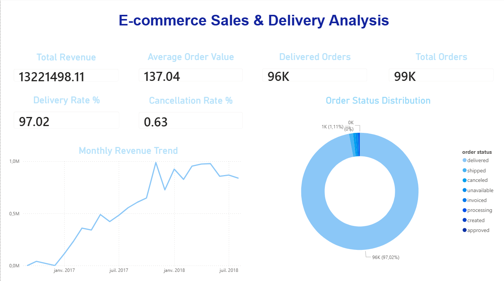
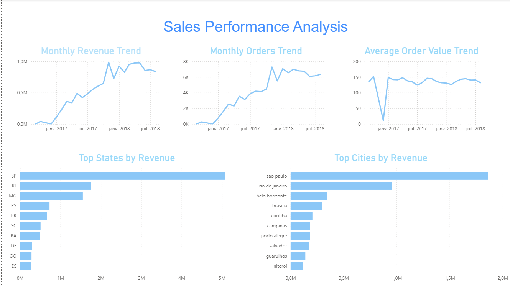
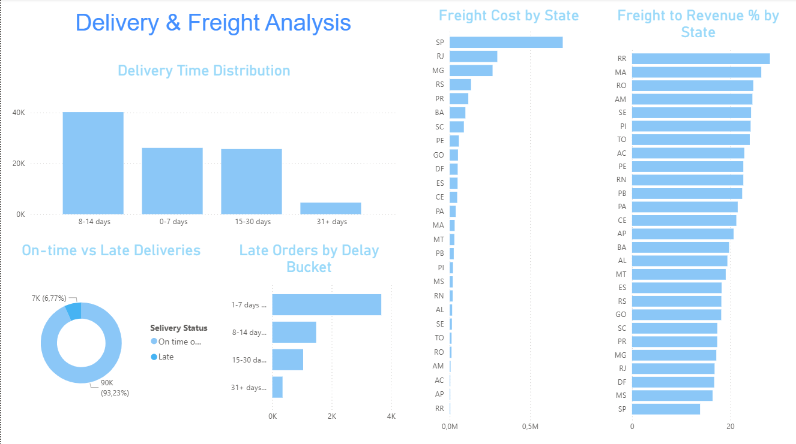
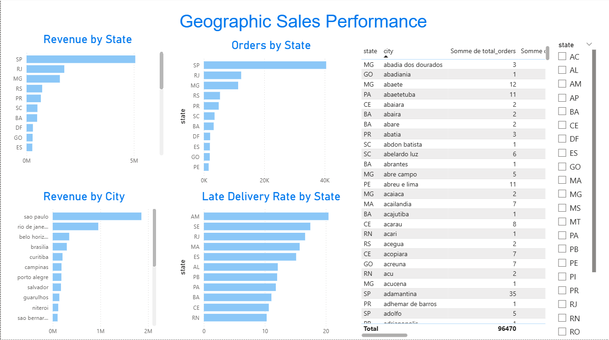

# E-commerce Sales & Delivery Analysis

## Project Overview

This project analyzes an e-commerce dataset to understand sales performance, order behavior, delivery efficiency, freight costs, and geographic sales distribution.

The project follows a complete end-to-end data analysis workflow, starting from raw CSV files, converting them into a SQLite database, running structured Python analysis scripts, exporting clean analysis results, and building an interactive Power BI dashboard.

This project was created as part of my Data Analyst portfolio.

---

## Business Questions

This project answers the following business questions:

- What is the total revenue generated from delivered orders?
- How many orders were placed?
- What is the average order value?
- Which states and cities generate the highest revenue?
- How do sales evolve over time?
- What is the distribution of order statuses?
- How long does delivery take on average?
- What percentage of orders are delivered late?
- How much does freight cost represent compared to revenue?
- Which geographic areas perform best in terms of sales and delivery?

---

## Tools Used

- Python
- Pandas
- SQLite
- SQL
- Power BI
- VS Code
- Git / GitHub

---

## Project Workflow

```text
Raw CSV Files
     ↓
SQLite Database
     ↓
Python Analysis Scripts
     ↓
CSV Export Files
     ↓
Power BI Dashboard
     ↓
Final Report
```

---

## Dataset Description

The project uses three main CSV files:

| File | Description |
|---|---|
| `olist_customers_dataset.csv` | Contains customer information such as customer ID, customer city, and customer state |
| `olist_orders_dataset.csv` | Contains order information such as order status, purchase date, delivery date, and estimated delivery date |
| `olist_order_items_dataset.csv` | Contains order item details such as product ID, seller ID, price, and freight value |

These files are loaded into a SQLite database with the following tables:

| Table | Description |
|---|---|
| `customers` | Customer-level information |
| `orders` | Order-level information |
| `order_items` | Item-level information for each order |

---

## Database Design

The CSV files are converted into a SQLite database located at:

```text
data/database/ecommerce.db
```

The database contains three main tables:

```text
customers
orders
order_items
```

The table relationships are:

```text
orders.customer_id = customers.customer_id
order_items.order_id = orders.order_id
```

The SQLite database is created automatically using Python scripts.

---

## Project Structure

```text
Ecommerce_Project0.1/
│
├── data/
│   ├── raw/
│   │   ├── olist_customers_dataset.csv
│   │   ├── olist_orders_dataset.csv
│   │   └── olist_order_items_dataset.csv
│   │
│   ├── database/
│   │   └── ecommerce.db
│   │
│   └── exports/
│       ├── total_revenue.csv
│       ├── total_orders.csv
│       ├── average_order_value.csv
│       ├── top_states_sales.csv
│       ├── top_cities_sales.csv
│       ├── monthly_sales_trend.csv
│       ├── order_status_analysis.csv
│       ├── delivery_time_analysis.csv
│       ├── late_orders_analysis.csv
│       ├── freight_analysis.csv
│       └── geographic_sales_performance.csv
│
├── src/
│   ├── database/
│   │   ├── create_database.py
│   │   ├── load_csv_to_sqlite.py
│   │   └── check_database.py
│   │
│   ├── analysis/
│   │   ├── 01_total_revenue.py
│   │   ├── 02_total_orders.py
│   │   ├── 03_average_order_value.py
│   │   ├── 04_top_states_cities_sales.py
│   │   ├── 05_monthly_sales_trend.py
│   │   ├── 06_order_status_analysis.py
│   │   ├── 07_delivery_time_analysis.py
│   │   ├── 08_late_orders_analysis.py
│   │   ├── 09_freight_analysis.py
│   │   └── 10_geographic_sales_performance.py
│   │
│   ├── utils/
│   │   ├── db_connection.py
│   │   └── export_results.py
│   │
│   ├── config.py
│   └── run_all_analyses.py
│
├── powerbi/
│   ├── ecommerce_dashboard.pbix
│   └── dashboard_screenshots/
│       ├── executive_overview.png
│       ├── sales_performance.png
│       ├── delivery_freight.png
│       └── geographic_performance.png
│
├── reports/
│   └── project_summary.pdf
│
├── README.md
├── requirements.txt
└── .gitignore
```

---

## Analysis Scope

Revenue is calculated only from delivered orders.

```text
Revenue = SUM(order_items.price)
```

Only orders with the status:

```text
delivered
```

are included in the final revenue calculation because they represent completed sales.

Canceled, unavailable, processing, shipped, created, and other non-delivered orders are excluded from final revenue calculations.

---

## Analysis Files

Each analysis is separated into an individual Python file.

| File | Analysis |
|---|---|
| `01_total_revenue.py` | Calculates total revenue from delivered orders |
| `02_total_orders.py` | Calculates total orders and key order status KPIs |
| `03_average_order_value.py` | Calculates average order value |
| `04_top_states_cities_sales.py` | Identifies top states and cities by revenue |
| `05_monthly_sales_trend.py` | Analyzes monthly sales performance |
| `06_order_status_analysis.py` | Analyzes order status distribution |
| `07_delivery_time_analysis.py` | Calculates actual delivery time |
| `08_late_orders_analysis.py` | Analyzes late deliveries compared to estimated delivery date |
| `09_freight_analysis.py` | Analyzes freight cost and its relation to revenue |
| `10_geographic_sales_performance.py` | Analyzes sales performance by state and city |

A master script runs all analyses in order:

```text
src/run_all_analyses.py
```

---

## Key Metrics

The project calculates the following KPIs:

- Total Revenue
- Total Orders
- Delivered Orders
- Canceled Orders
- Average Order Value
- Monthly Revenue
- Monthly Orders
- Revenue by State
- Revenue by City
- Average Delivery Time
- Late Delivery Rate
- Total Freight Cost
- Average Freight per Order
- Freight to Revenue Percentage
- Geographic Sales Performance

---

## How to Run the Project

### 1. Clone the repository

```bash
git clone <https://github.com/salahsd/ecommerce-sales-delivery-analysis.git>
cd Ecommerce_Project0.1
```

### 2. Install dependencies

```bash
pip install -r requirements.txt
```

### 3. Add raw CSV files

Place the raw CSV files inside:

```text
data/raw/
```

Expected files:

```text
data/raw/olist_customers_dataset.csv
data/raw/olist_orders_dataset.csv
data/raw/olist_order_items_dataset.csv
```

### 4. Load CSV files into SQLite

```bash
python -m src.database.load_csv_to_sqlite
```

### 5. Check the database

```bash
python -m src.database.check_database
```

Expected output:

```text
[OK] Database check completed successfully.
```

### 6. Run all analyses

```bash
python -m src.run_all_analyses
```

Expected output:

```text
[OK] All analyses completed successfully.
```

The exported CSV files will be created inside:

```text
data/exports/
```

---

## Exported Analysis Files

The analysis scripts generate the following CSV files:

| Export File | Description |
|---|---|
| `total_revenue.csv` | Total revenue from delivered orders |
| `total_orders.csv` | Total orders and order status KPIs |
| `average_order_value.csv` | Average order value metrics |
| `top_states_sales.csv` | Top states by revenue |
| `top_cities_sales.csv` | Top cities by revenue |
| `monthly_sales_trend.csv` | Monthly sales trend |
| `order_status_analysis.csv` | Order status distribution |
| `delivery_time_analysis.csv` | Delivery time analysis |
| `late_orders_analysis.csv` | Late delivery analysis |
| `freight_analysis.csv` | Freight cost analysis |
| `geographic_sales_performance.csv` | Geographic sales performance |

---

## Power BI Dashboard

The exported CSV files are used to build an interactive Power BI dashboard.

Dashboard file:

```text
powerbi/ecommerce_dashboard.pbix
```

The dashboard contains four pages:

```text
1. Executive Overview
2. Sales Performance
3. Delivery & Freight Analysis
4. Geographic Sales Performance
```

---

## Dashboard Preview

### Executive Overview

This page provides a high-level summary of the business performance, including total revenue, total orders, delivered orders, average order value, delivery rate, cancellation rate, monthly revenue trend, and order status distribution.



---

### Sales Performance

This page analyzes sales trends over time and shows the best-performing states and cities by revenue.



---

### Delivery & Freight Analysis

This page analyzes delivery time, late deliveries, freight cost by state, and freight cost as a percentage of revenue.



---

### Geographic Sales Performance

This page analyzes sales performance by state and city, including revenue, orders, customers, delivery performance, and freight metrics.



---

## Power BI Pages

### 1. Executive Overview

Main visuals:

- Total Revenue card
- Total Orders card
- Delivered Orders card
- Average Order Value card
- Delivery Rate card
- Cancellation Rate card
- Monthly Revenue Trend line chart
- Order Status Distribution donut chart

### 2. Sales Performance

Main visuals:

- Monthly Revenue Trend
- Monthly Orders Trend
- Average Order Value Trend
- Top States by Revenue
- Top Cities by Revenue

### 3. Delivery & Freight Analysis

Main visuals:

- Delivery Time Distribution
- On-time vs Late Deliveries
- Late Orders by Delay Bucket
- Freight Cost by State
- Freight to Revenue Percentage by State

### 4. Geographic Sales Performance

Main visuals:

- Revenue by State
- Revenue by City
- Orders by State
- Late Delivery Rate by State
- City Performance Details table
- State slicer

---

## Main Insights

The analysis shows several important business insights:

- Delivered orders represent the majority of total orders.
- Revenue is highly concentrated in a few major states.
- São Paulo and other major cities generate the highest sales volume.
- Monthly revenue shows strong growth over time.
- Most delivered orders arrive on time or earlier than the estimated delivery date.
- A smaller percentage of orders are delivered late.
- Freight cost varies significantly by state.
- Some states have a higher freight-to-revenue percentage, which may affect profitability.
- Geographic performance analysis helps identify high-value regions and potential areas for improvement.

---

## Business Recommendations

Based on the analysis, the following recommendations can be made:

- Focus marketing efforts on the best-performing states and cities.
- Investigate states with high freight-to-revenue percentages.
- Improve delivery operations in regions with higher late delivery rates.
- Monitor monthly revenue and order trends regularly.
- Use geographic analysis to support regional growth and logistics decisions.

---

## Final Report

A complete project summary report is available here:

```text
reports/project_summary.pdf
```

The report includes:

- Project overview
- Business objectives
- Tools used
- Dataset description
- Data pipeline
- Analysis methodology
- Dashboard screenshots
- Main findings
- Business recommendations
- Future improvements

---

## Project Status

```text
SQLite Database: Completed
Python Analysis Scripts: Completed
CSV Exports: Completed
Power BI Dashboard: Completed
README Documentation: Completed
Final PDF Report: Completed
```

---

## Future Improvements

Possible future improvements include:

- Adding product category analysis
- Adding seller performance analysis
- Creating customer segmentation
- Adding payment and review analysis
- Building advanced Power BI measures using DAX
- Adding sales forecasting
- Publishing the dashboard to Power BI Service
- Automating the full pipeline from data loading to dashboard refresh

---

## Skills Demonstrated

This project demonstrates the following data analysis skills:

- Data extraction from CSV files
- Data modeling using SQLite
- SQL querying
- Data cleaning and preparation
- Python scripting
- KPI creation
- Exploratory data analysis
- Business analysis
- Data visualization with Power BI
- Dashboard design
- Project documentation
- Portfolio project organization

---

## Contact

**Salah Chenouf**

LinkedIn: [Salah Chenouf](https://www.linkedin.com/in/salah-chenouf-711589b2/)

Email: salah.chenouuf@yahoo.com